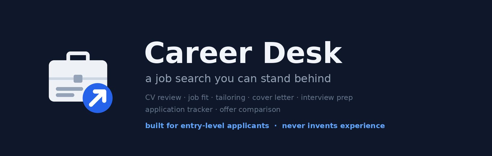

# Career Desk



[](https://github.com/najikay/claude-career-desk/actions/workflows/tests.yml)

**A job search you can stand behind.** Seven skills that take you from a CV and a job posting to a strong, honest application, and keep the search organised. Built for entry-level roles: final-year students, new graduates, career changers, anyone whose CV is short on paid experience in the field.

## The promise

**Career Desk works only from your facts.** It reorders, cuts and rewords what is on your CV, and asks questions to draw out what you left off. It is built not to add a skill, a tool, a title, an employer, a date, a grade or a number you did not give. Where a line needs a detail that is not there, it writes `[add: …]` and asks you. Every change it makes is listed, so you can check it.

It is also told to keep your wording honest: *answered* does not become *resolved*, *built with two teammates* does not become *led*, and nothing about what you learned or what kind of person you are is said for you. This is the harder half, and the measurements below show it is very good at it but not perfect. **Read the verbs before you send anything.**

Measured, not claimed (details under Tests and evals): across 21 graded runs with a strict judge, Career Desk invented a fact in none, and kept the wording honest in 18. Claude without the plugin, on the same tasks, invented a fact in 15 of 21.

This is advice, not a guarantee of an interview or an offer, and not legal, tax or immigration advice.

## The skills

| Skill | Say something like | What you get |
|---|---|---|
| **cv-review** | "Review my CV." "Why am I not getting interviews?" | How your CV reads in thirty seconds, each weak line with a rewrite built from your own facts, skills listed with nothing to back them, what is missing, and the three changes that matter most. |
| **job-fit** | "Should I apply for this?" "Am I qualified?" | Every requirement of the posting marked met, partly or not met, with the CV line that proves it; an apply, stretch or skip verdict; what to do about each gap. No made-up percentage score. |
| **cv-tailor** | "Tailor my CV to this job." | Your CV reordered and reworded for one posting, in its terms where they are true of you, with a list of every change and a plain list of what the posting asks that your CV cannot show. |
| **cover-letter** | "Write a cover letter for this job." | A short letter built from two or three real matches between your CV and the posting, in plain words, with no stock phrases, and a note of which CV line backs each claim. |
| **interview-prep** | "I have an interview next week." | The questions this posting is likely to produce, answer outlines from your own CV, STAR stories from your real projects and jobs, honest answers for the gaps, and questions to ask them. |
| **application-tracker** | "Track my applications." "What should I follow up on?" | A table of applications with stage, next step and date, and a list of what is due this week. |
| **offer-compare** | "Help me decide between these offers." | Offers side by side on what you say matters, pay on the same basis with the arithmetic shown, the unknowns to ask about, and what would tip the choice. The decision stays yours. |

## How a search goes

1. **cv-review** once, to get the base CV right.
2. For each posting: **job-fit** to decide whether to apply, then **cv-tailor** and **cover-letter**.
3. **application-tracker** as you apply and hear back.
4. **interview-prep** when an interview comes.
5. **offer-compare** at the end.

Each skill also works on its own.

## What it is like at entry level

A short CV is not an empty one. The evidence is in a final-year project, a thesis, an internship, a part-time job, a volunteer role, and it is usually undersold: buried under Education, written as duties, missing what you yourself did. Career Desk looks for that evidence and says it plainly. A café job is evidence of pace and of dealing with people; it is described as that, not dressed up as something else. "1+ years of experience" on a junior posting is read as what it often is, a wish, while a real wall such as the right to work or an on-site location is named as a wall.

## Where it runs

Wherever Claude plugins with skills run: the Claude apps, Claude Code and Cowork. It is skills only: no server and nothing to configure after installing.

## Your data

The full statement is in [Privacy](PRIVACY.md). In short:

- Career Desk is a set of instructions for Claude. It adds no code and sends nothing itself.
- What you paste is handled like anything else in your Claude conversation, under the same terms.
- The skills tell Claude never to put your CV text, name or contact details into a web search. If you ask it to look an employer up, it searches with the company and role names only.
- It never asks for your age, a photo, your family status, health, religion, nationality, ethnicity, gender, military or national service, immigration status or a criminal record, and it does not suggest adding them.
- It does not scrape job sites. You paste the posting.
- In a plain chat the application tracker cannot remember between conversations: it gives you the table to keep and paste back, and it says so. In Claude Code or Cowork it saves `applications.md` only when you ask for a file.
- You may want to remove your phone number and home address before pasting a CV; nothing here needs them.

## Install

From the Claude directory: search for Career Desk. In Claude Code:

```
/plugin marketplace add najikay/claude-career-desk
/plugin install career-desk@claude-career-desk
```

## Tests and evals

- `python -m unittest discover -s tests` checks that every skill's frontmatter is valid and that the sentences carrying each promise are present, word for word: the no-invention rule, the care with personal details, no percentage scores, no value for share options. Removing a rule fails the build. CI runs it on Linux and Windows.
- `evals/` holds one case per skill, all built on one fictional applicant, Sam Rivera, whose CV lists C++ with nothing to show for it and whose robot project used ROS 1, applying to a job that needs C++ and ROS 2. Each case is graded three ways: **facts** fails if anything is invented (C++ experience, ROS 2, a made-up number or date, a fact about the employer, a value for unexplained share options) and counts double; **wording** fails if a line claims more than you gave (a stronger verb, a guess stated as fact); **shape** checks that the parts the skill promises are there. `claude plugin eval .` runs each case with the plugin and without it.

Last run (Claude Code 2.1.288, three runs per case and arm, judged by Claude Sonnet, 2026-10-05). Each cell is the number of runs out of three that passed:

| Skill | No invented facts | Honest wording | All parts present |
|---|---|---|---|
| cv-review | 3 | 3 | 3 |
| job-fit | 3 | 2 | 3 |
| cv-tailor | 3 | 3 | 3 |
| cover-letter | 3 | 3 | 3 |
| interview-prep | 3 | 2 | 3 |
| application-tracker | 3 | 2 | 3 |
| offer-compare | 3 | 3 | 3 |
| **With Career Desk** | **21 of 21** | **18 of 21** | **21 of 21** |
| Claude without the plugin | 6 of 21 | 2 of 21 | 0 of 21 |

How to read it:
- The judge is strict and sees only the answer, so each grader carries the user's whole message to check against. A stronger judge matters: the default small judge passed answers that this one caught.
- The three wording misses were small and are the reason for "read the verbs": for example a rough time estimate stated a little too firmly. None added a skill, a tool, a number or an employer.
- "Without the plugin" is plain Claude given the same message. It usually wrote a good-looking answer that claimed more than the CV says.
- One fictional applicant and one posting are a narrow test. Real CVs will find cases these do not.

## Author

Naji Kayal. Issues and suggestions are welcome here.

## License

Apache-2.0. See `LICENSE`. See `CHANGELOG.md` for versions.
